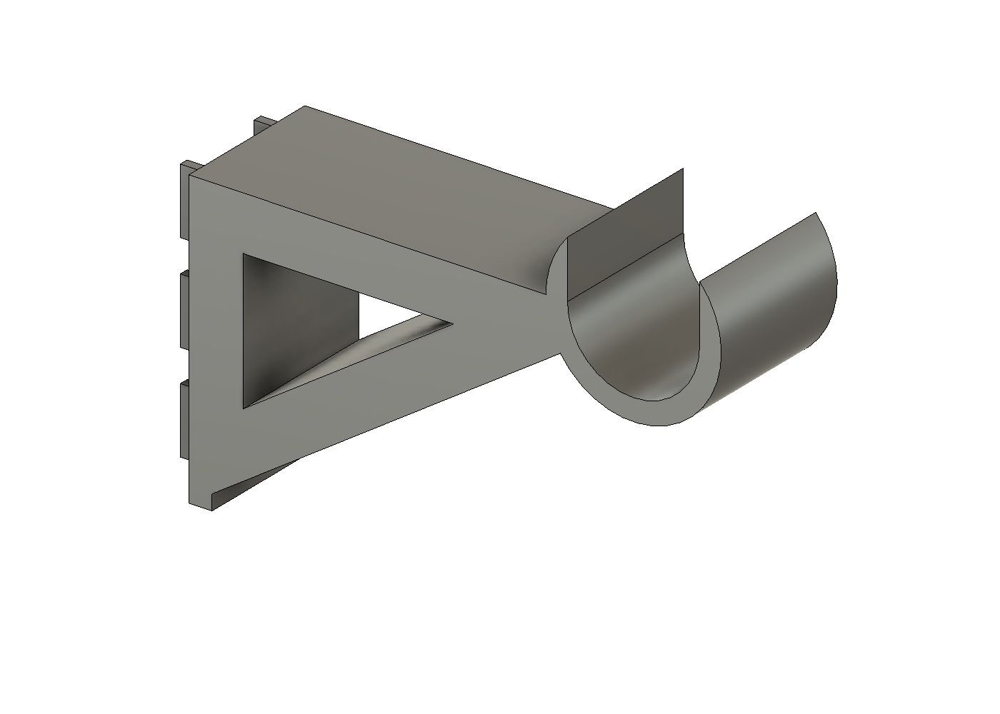

# LAN Spool Shelf

Filament spool storage for an Ergotron LAN Organizer 3000. Two 3D-printed
brackets hook into the slotted DuraFrame uprights and carry a horizontal rod
— 1" schedule 40 PVC by default, or a wooden dowel — that spools hang on.
No drilling, no hardware; the brackets hook in like Ergotron's own shelves
and lift out the same way.



## Parts

| File | What it is |
|---|---|
| `exports/slot_gauge.stl` | **Print this first.** A ~16 cm³ hook plate that verifies the slot fit before you spend plastic on brackets. |
| `exports/spool_rod_bracket.stl` | The bracket. Print **two per rod**; it is symmetric, so there is no left/right hand. |
| `cad/*.step`, `cad/*.f3d` | The same parts as CAD, exported by the same build run as the STLs. |

## Fit check workflow

The upright slot geometry was measured by hand (3/4" tall slots, 1" vertical
pitch, ~1/8" wide, two columns ~1" apart) and three numbers are still
assumptions: slot width, column spacing, and face metal thickness.

1. Print `slot_gauge.stl` flat on its side.
2. Hook it into the upright: both tab columns should enter their slots, drop
   ~14 mm, and sit flush with no rock.
3. If it binds or rattles, edit the numbers at the top of
   `scripts/build_rod_bracket.py` (`SLOT_WIDTH`, `SLOT_COLUMN_SPACING`,
   `FACE_METAL_THICKNESS`), rebuild, and re-print the gauge.
4. When the gauge seats cleanly, print two brackets.

## Rod

For the 30" DuraFrame (10-063-100): upright centres are ~28" apart, so cut
the rod to ~29.5" (750 mm) to span both saddles fully. A 1" schedule 40 PVC
pipe sags under 3 mm in the middle with eight 1 kg spools on it; a 1" hard
wood dowel is stiffer still. For a different rod, set `ROD_OUTER_DIAMETER`
and rebuild — the saddle pocket adds 0.8 mm of clearance.

The saddle is open on top: lift the rod out to slide spools on. Nothing
retains it because nothing ever pulls it up; add a velcro strap over the
saddle if you want insurance.

## Printing

- Lie the bracket on its flat side (rod axis vertical in the slicer), so the
  layer planes coincide with the loaded plane. **Do not print it upright** —
  that puts every layer seam across the hook lips.
- PETG or PLA+, 4+ perimeters, 40 % infill or more.
- Load rating: sized for ~6 kg per bracket (a full rod of spools is ~10 kg
  across two brackets, and the top hook row sees ~100 N of tension at that
  load, roughly a 2x margin in PETG).

## Rebuilding

Fusion 360 must be running with its MCP server on `127.0.0.1:27182`. Then:

```sh
python3 scripts/run_in_fusion.py scripts/build_rod_bracket.py            # bracket
python3 scripts/run_in_fusion.py scripts/build_rod_bracket.py --variant gauge
```

Each run builds a fresh document, probes the geometry numerically (the run
fails loudly if any probe misses), and exports the STL, STEP, and F3D
together. Sanity-check a mesh afterwards with:

```sh
.venv/bin/python scripts/check_stl.py exports/spool_rod_bracket.stl <mm3 from build output>
```

The Ergotron order guide lives in `docs/03-006_obsolete.pdf`; it documents
frame widths and capacities but not slot geometry, hence the hand
measurements above.
