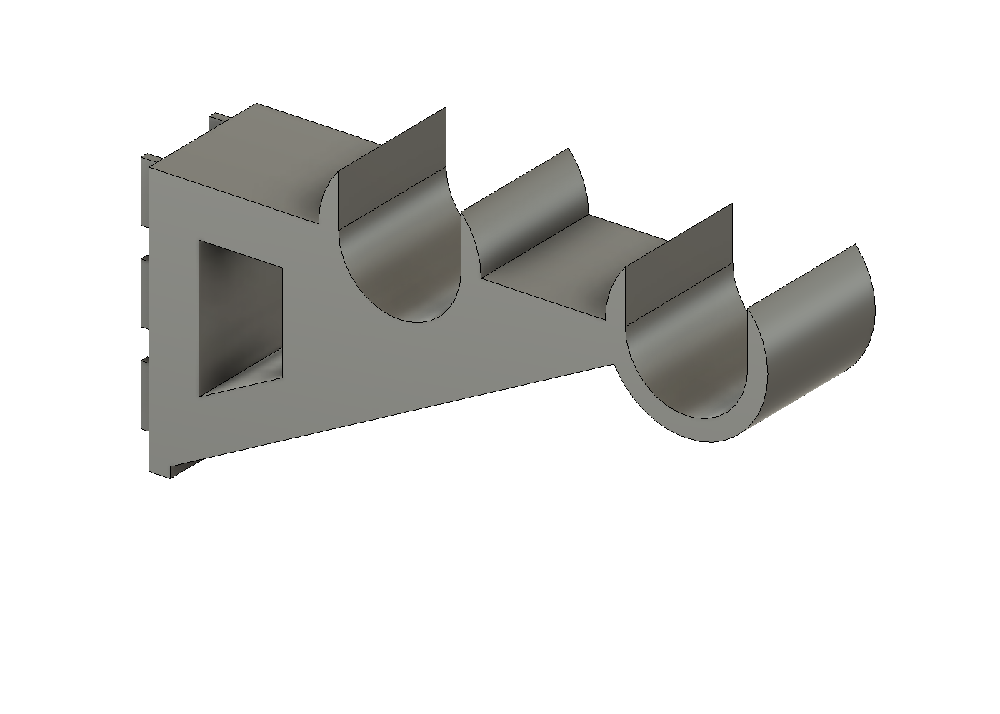

# LAN Spool Shelf

Filament spool storage for an Ergotron LAN Organizer 3000. Two 3D-printed
brackets hook into the slotted DuraFrame uprights and carry **two parallel
rods** — 1" schedule 40 PVC by default, or wooden dowels — and spools rest
in the valley between the rods. Any spool lifts straight out (and rolls
freely as filament feeds) without touching the rods. No drilling, no
hardware; the brackets hook in like Ergotron's own shelves.



## Parts

| File | What it is |
|---|---|
| `exports/slot_gauge.stl` | **Print first.** Hook plate only — verifies the slot fit against the real upright. |
| `exports/saddle_coupon.stl` | **Print second.** Thin slice of the two-saddle arm tip — verifies rod pocket diameter and drop-in fit against the real pipe/dowel. ~12 cm³. |
| `exports/spool_cradle_bracket.stl` | The bracket. Print **two per shelf level**; it is symmetric, no left/right hand. |
| `cad/*.step`, `cad/*.f3d` | The same parts as CAD, exported by the same build run as the STLs. |

## Fit check workflow

The upright slot geometry was measured by hand (3/4" tall slots, 1" vertical
pitch, ~1/8" wide). Each upright carries a single slot column — the "double
track" at the middle of the 60" module is just the two joined frames'
columns sitting side by side — so the bracket hooks one column with a
single centred blade column, four rows tall, and mounts on any upright.
Two numbers are still assumptions: slot width and face metal thickness.

1. Print `slot_gauge.stl` flat on its side and hook it into the upright:
   the blade column should enter its slots, drop ~14 mm, and sit flush
   with no rock. If it binds or rattles, edit `SLOT_WIDTH` or
   `FACE_METAL_THICKNESS` at the top of `scripts/build_rod_bracket.py`,
   rebuild, re-print. (First gauge print, 2026-09-02: blades entered and
   dropped a few mm, then pinched before seating — the throat clearance
   has since been widened from 0.8 to 1.8 mm and the lips got lead-in
   chamfers. Re-test with the current STL.)
2. Print `saddle_coupon.stl` and drop your actual rod stock into both
   pockets: it should seat fully and lift out without force. Adjust
   `ROD_OUTER_DIAMETER` / `SADDLE_CLEARANCE` if not.
3. When both coupons pass, print two brackets.

## Geometry

- Rod axes sit 70 mm and 150 mm out from the upright face (80 mm apart), at
  the same height. A 200 mm spool rests on both rods at a ~20° contact
  half-angle — stable, but light enough to lift straight out — and its
  rearmost point clears the upright face by ~10 mm.
- A resting spool's top sits ~285 mm above the bracket's bottom edge, so
  leave ~12" of frame space above the mounting slots.
- For the 30" DuraFrame (10-063-100): upright centres are ~28" apart; cut
  rods to ~29.5" (750 mm) to span both saddles fully. See "Rod materials,
  sag, and cost" below for what to make them from.
- Nothing retains the rods because nothing pulls them up: spools press them
  into the saddles and are lifted off the rods, never with them.
- The bracket is 24 mm wide — narrower than the 1" gap between the two
  slot columns at the module centre, so both bays can carry cradles at the
  same height without the centre brackets colliding.

## Rod materials, sag, and cost

Capacity per level is ~12 kg total (two brackets at ~6 kg each, ~2x
structural margin) — a full row of nine 1 kg spools, or count 3 kg spools
by weight. Rod strength is never the limit (PVC runs at ~2 MPa of a
~50 MPa allowable); **stiffness is**, because sagging rods form a shallow
valley and spools slowly roll and bunch toward the centre.

Mid-span sag per rod at full load (~5.6 kg/rod over the 711 mm span), and
cost per level (two ~29.5" rods; Home Depot, 2026-09):

| Rod | Sag | Fits stock 34.2 mm pocket? | Cost per level |
|---|---|---|---|
| 1" sch 40 PVC (default) | ~2.4 mm, creeps to 4-6 mm over months | yes | ~$5 (10 ft = 4 rods) |
| 1" sch 40 aluminum pipe | ~0.1 mm, no creep | **yes — same 33.4 mm OD as PVC** | ~$32 ($48/8 ft = 3 rods) |
| 1-1/4" hardwood dowel | ~0.4 mm | close (2.5 mm play — acceptable) | ~$10 |
| 1" hardwood dowel | ~1.0 mm | no — `ROD_OUTER_DIAMETER = 25.4` | ~$6 |
| 3/4" EMT steel conduit | ~0.25 mm | no — `ROD_OUTER_DIAMETER = 23.4` | ~$5 (10 ft = 4 rods) |
| 1" EMT steel conduit | ~0.1 mm | no — `ROD_OUTER_DIAMETER = 29.5` | ~$7 |

PVC is fine to start, and the open saddles mean the rods can be swapped
any time. The aluminum pipe is the nicest no-rebuild upgrade but ~6x
EMT's price for a sag difference (~0.1 vs ~0.25 mm) that is invisible in
practice; EMT is the stiffness-per-dollar champion and costs only a
pocket rebuild (one constant plus a saddle-coupon re-print). Deburr cut
ends whichever you pick — spool flanges occasionally touch the rod ends
when loading.

## Printing

- Lie the bracket on its flat side (rod axes vertical in the slicer), so
  the layer planes coincide with the loaded plane. **Do not print it
  upright** — that puts every layer seam across the hook lips.
- **Material: ASA on the Core One Plus** (enclosed, so warp is handled);
  PETG is the runner-up and completely adequate. The hooks live under
  constant tension, so the failure modes that matter are creep and brittle
  fracture: ASA creeps less than PETG over months under load and stays
  ductile; PLA/PLA+ creeps too much; CF blends are stiff but brittle in
  exactly the thin blade sections that must not snap. The 180 mm part fits
  the 250 x 220 bed lying on its side with room to spare.
- 4+ perimeters, 40 % infill or more.
- Load rating: sized for ~6 kg per bracket (a full level of spools is
  ~10 kg across two brackets; the single hook column sees ~90 N of tension
  at the top row at that load, about a 2x margin in PETG).

## Rebuilding

Fusion 360 must be running with its MCP server on `127.0.0.1:27182`. Then:

```sh
python3 scripts/run_in_fusion.py scripts/build_rod_bracket.py                  # bracket
python3 scripts/run_in_fusion.py scripts/build_rod_bracket.py --variant gauge
python3 scripts/run_in_fusion.py scripts/build_rod_bracket.py --variant coupon
```

Each run rebuilds the part inside its saved document in the **"LAN Spool
Shelf" Fusion cloud project** (created automatically), probes the geometry
numerically (the run fails loudly if any probe misses), exports the STL,
STEP, and F3D together, and saves a **new Fusion version** of the document
with a description recording the key dimensions — so the model's history
lives in Fusion's version list as well as in git. Every document carries a
user-parameter table mirroring the script constants: the extrude widths
(`bracketWidth`, `couponWidth`, `hookTabWidth`) actually drive the model
and are safe to edit live; the rest are marked reference-only because the
sketch profiles are computed by the script — change those in
`scripts/build_rod_bracket.py` and rebuild. Sanity-check a mesh afterwards with:

```sh
.venv/bin/python scripts/check_stl.py exports/spool_cradle_bracket.stl <mm3 from build output>
```

The Ergotron order guide lives in `docs/03-006_obsolete.pdf`; it documents
frame widths and capacities but not slot geometry, hence the hand
measurements above.
